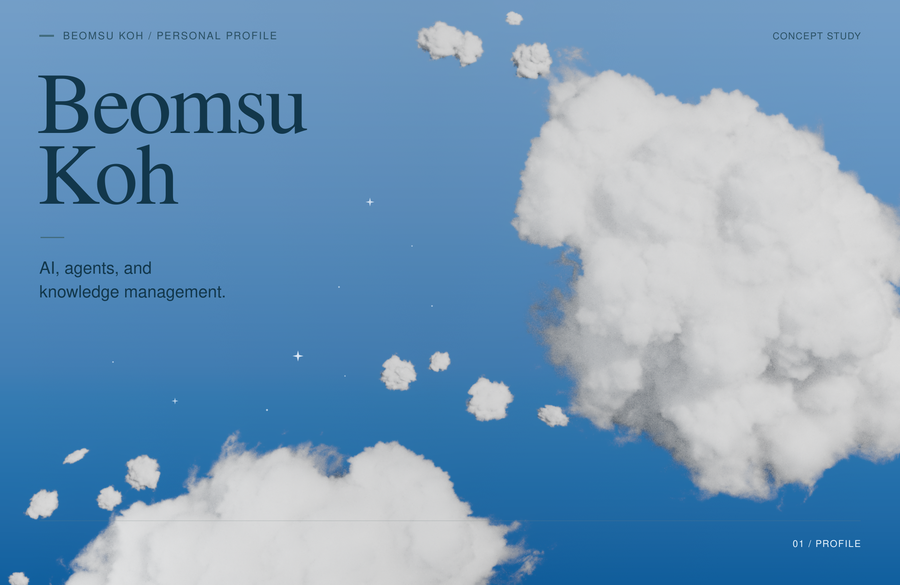

  

<h1 align="center">Beomsu Koh</h1>

  <strong>AI, agents, and knowledge management.</strong> 
  Building tools that help people focus on what matters.

  <a href="https://beomsukoh.com/">Website</a> ·
  <a href="https://github.com/SeniorAILab">Senior AI Lab</a> ·
  <a href="#open-source">Projects</a> ·
  <a href="#find-me">Find me</a>

## What I’m building

I’m **Co-founder & CTO at [Senior AI Lab](https://github.com/SeniorAILab)**, leading technology and service development. I’m currently building **SeeON**, a safety-monitoring service for eldercare.

I’m also building **[Oh My Second Brain](https://github.com/Xia-Ataraxia/oh-my-second-brain)**, a user-owned knowledge and convention layer that connects Obsidian and Markdown vaults with AI agents.

My interests meet at AI, agents, and knowledge management: how they can support real work, and how we can keep our attention on what matters.

## What guides me

All technology amplifies intent. I believe good intent makes the world better.

I want to solve the problem of attention theft in modern society and help people stay truly focused on what matters to them.

## Open source

I maintain [Metadata-Auto-Classifier](https://github.com/GoBeromsu/Metadata-Auto-Classifier), an Obsidian plugin.

I’ve also contributed to:

- [online-ml/deep-river · PR #116](https://github.com/online-ml/deep-river/pull/116)
- [kmsk99/kr-book-info-plugin · PR #15](https://github.com/kmsk99/kr-book-info-plugin/pull/15)

## A little background

I hold an MSc in Advanced Computer Science from [the University of Sheffield](https://www.sheffield.ac.uk/). I share what I learn through software projects, writing, and teaching.

## Find me

[Website](https://beomsukoh.com/) · [YouTube](https://www.youtube.com/@beomsuKoh) · [LinkedIn](https://www.linkedin.com/in/beomsu-koh/) · [X](https://x.com/BeromArtDev) · [Instagram](https://www.instagram.com/hebrews_0218/) · [Threads](https://www.threads.com/@hebrews_0218)

## Artwork

The aerial cloud artwork was composed and rendered in Blender using the Walt Disney Animation Studios Cloud Data Set, with the dataset’s reference photograph credited to Kevin Udy. The adapted artwork is licensed under [CC BY-SA 3.0](https://creativecommons.org/licenses/by-sa/3.0/); see [artwork credits and reuse terms](./assets/ARTWORK.md). This license applies to the cloud artwork, not repository source code.
